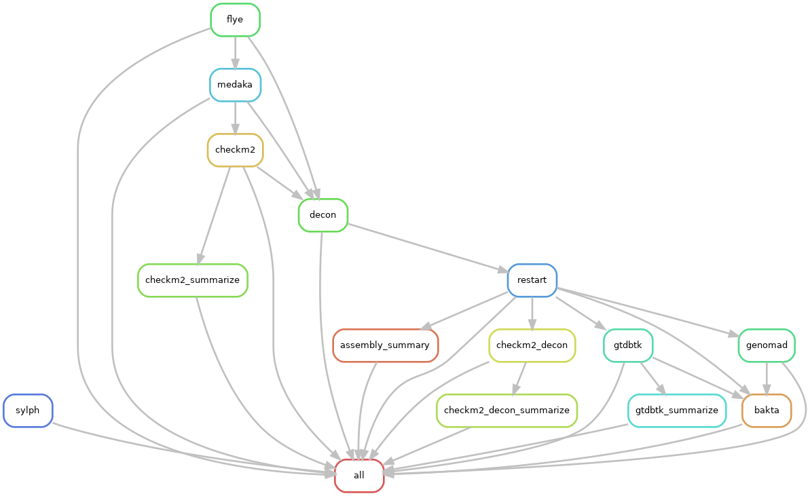

Assembly, QC and Annotation pipeline for bacterial isolates collected as part of
the UTIr project.

# The pipeline comprises the following steps

- prescreen of sequencing libraries for contamination with `sylph` 
- assembly of long-reads with `flye`
- polishing with `medaka`
- completeness and contamination assessment with `checkm2`
- decontamination in flagged assemblies using a low coverage filter
- synchronization start and orientation of circular chromosomes
- taxonomic classification with `gtdbtk`
- gene prediction and annotation with `bakta`
- plasmid and (pro)virus annotation with `genomad`

# Input
The pipeline expects as input a folder `analysis/reads/` with compressed minion
fq.gz files.

# Dependencies and Databases
The pipeline is set up to use isolated rule-specific conda
environments. Dependencies, thus will be automatically installed once the
respective environment is is loaded/created for the first time. Databases are
automatically downloaded via post-deploy scripts when the respective
environments are used.
